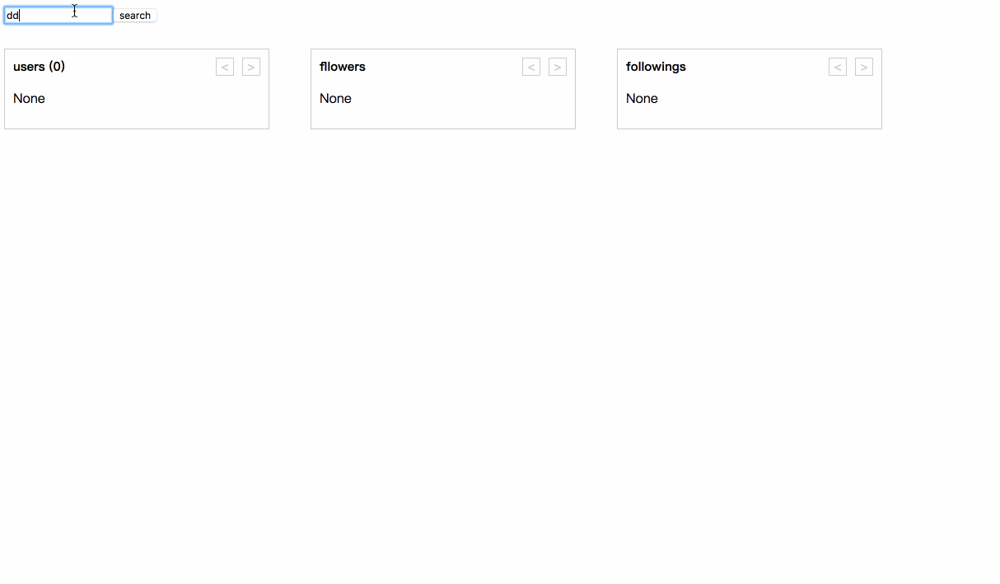

Using series of data flow way production:

## includes

* [redux-thunk + async](./redux-thunk)
* [redux-saga](./redux-saga)
* [redux-observable](./redux-observable)
* [MobX](./mobx)

## TODO

* [ ] Elm
* [ ] cycle
